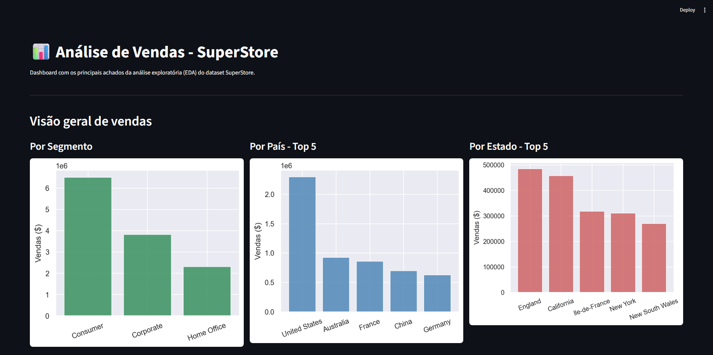

📊 Análise de Vendas — SuperStore

Projeto de Análise Exploratória de Dados (EDA) desenvolvido em Python com o objetivo de praticar o fluxo completo de uma análise de dados: levantamento, limpeza e tratamento, exploração, visualização de insights e criação de um dashboard interativo.

O dataset utilizado possui 51.290 registros de vendas, contendo informações sobre clientes, produtos, categorias, localização, vendas, lucro, descontos e custos de envio.

🖥️ Dashboard

O dashboard apresenta uma visão geral dos principais resultados encontrados durante a análise.

🎯 Objetivos do projeto

- Realizar o entendimento inicial da base;
- Verificar valores nulos, duplicados e possíveis inconsistências;
- Corrigir tipos de dados;
- Analisar vendas por segmento, país, estado, região, categoria e subcategoria;
- Avaliar a evolução das vendas e do lucro ao longo do tempo;
- Investigar a relação entre vendas, lucro e descontos;
- Criar visualizações para facilitar a interpretação dos dados;
- Desenvolver um dashboard com Streamlit.

🔎 Principais análises

Vendas por segmento;
- Top 5 países em vendas;
- Top 5 estados em vendas;
- Vendas por região;
- Vendas por categoria;
- Vendas por subcategoria;
- Evolução das vendas por ano;
- Evolução do lucro por ano;
- Correlação entre vendas e lucro;
- Correlação entre desconto e lucro;
- Lucro por subcategoria;
- Impacto das faixas de desconto no lucro.